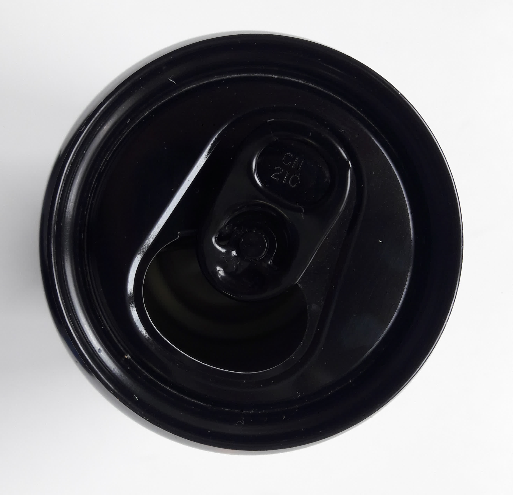
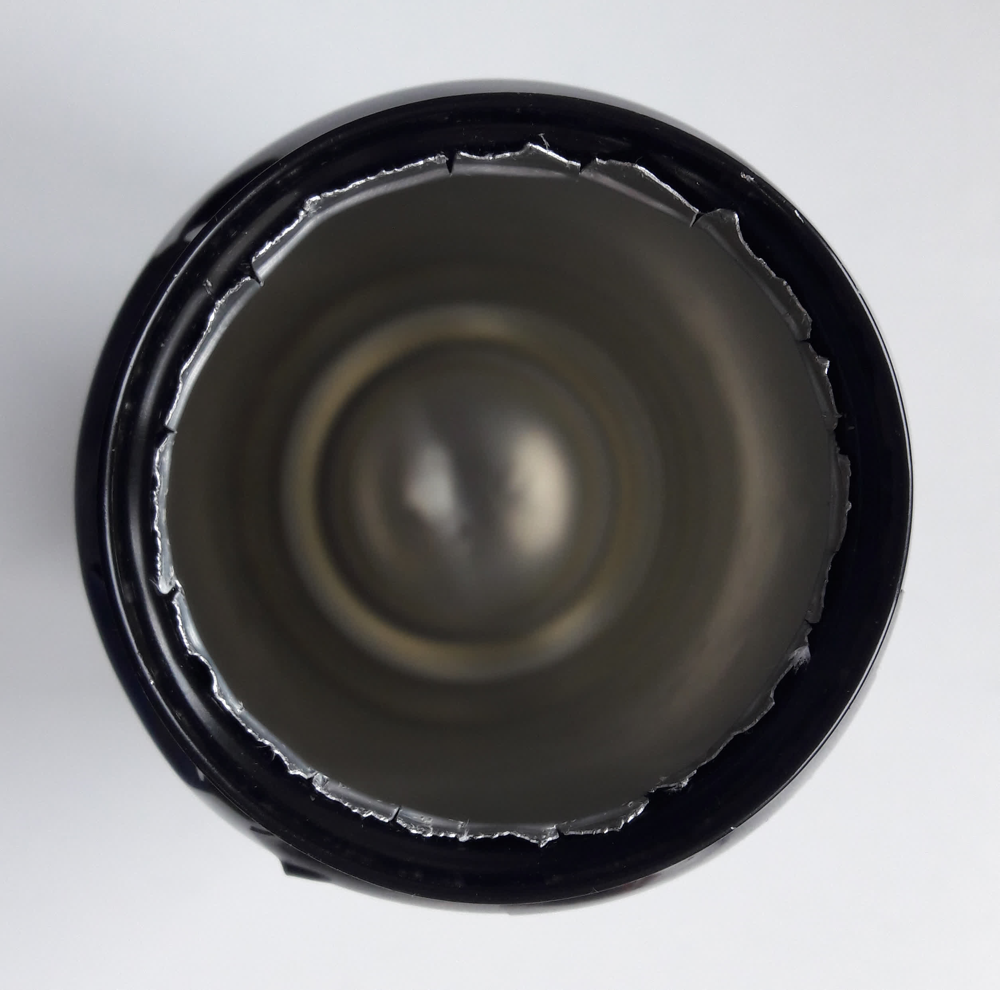
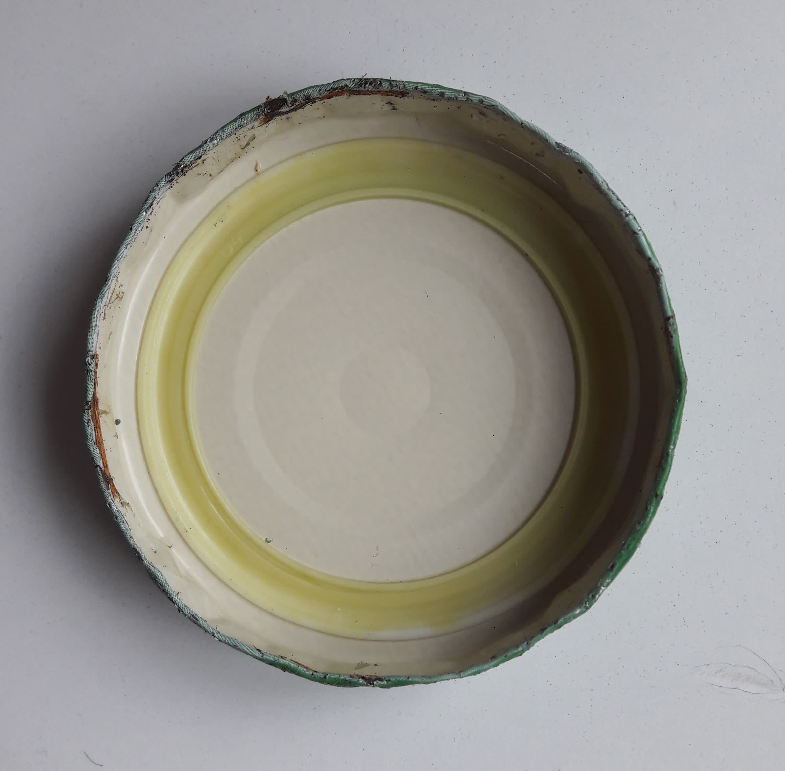
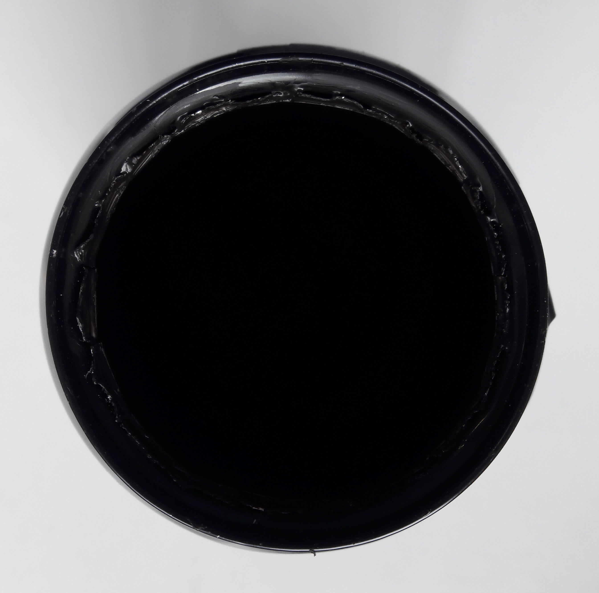
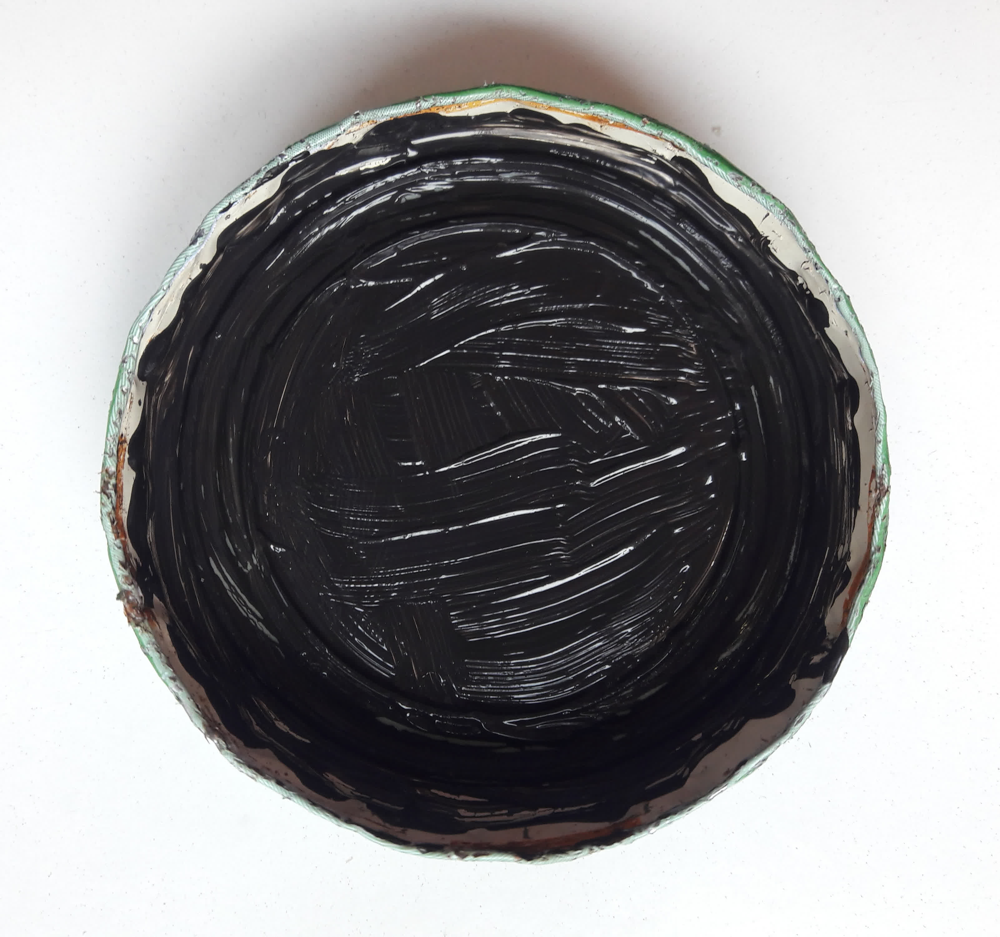
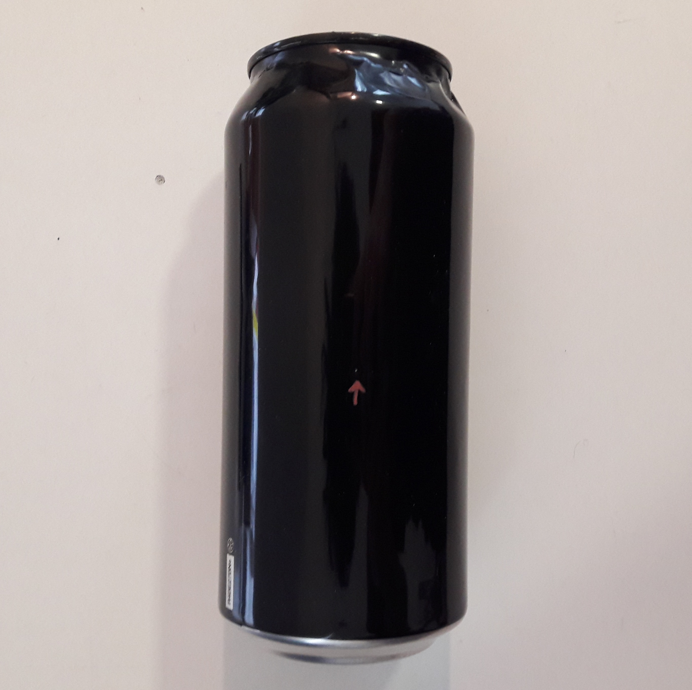
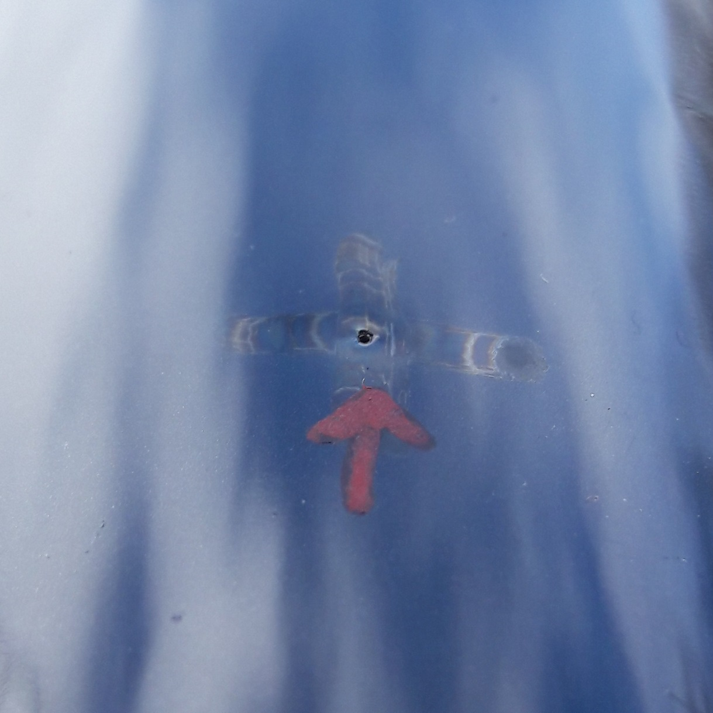
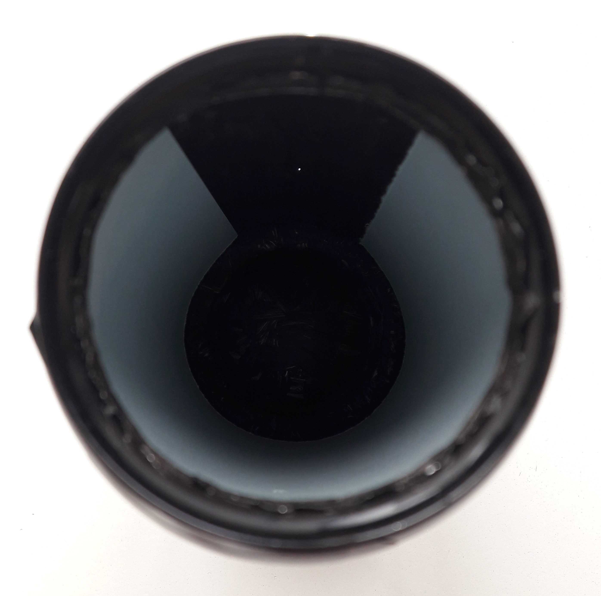
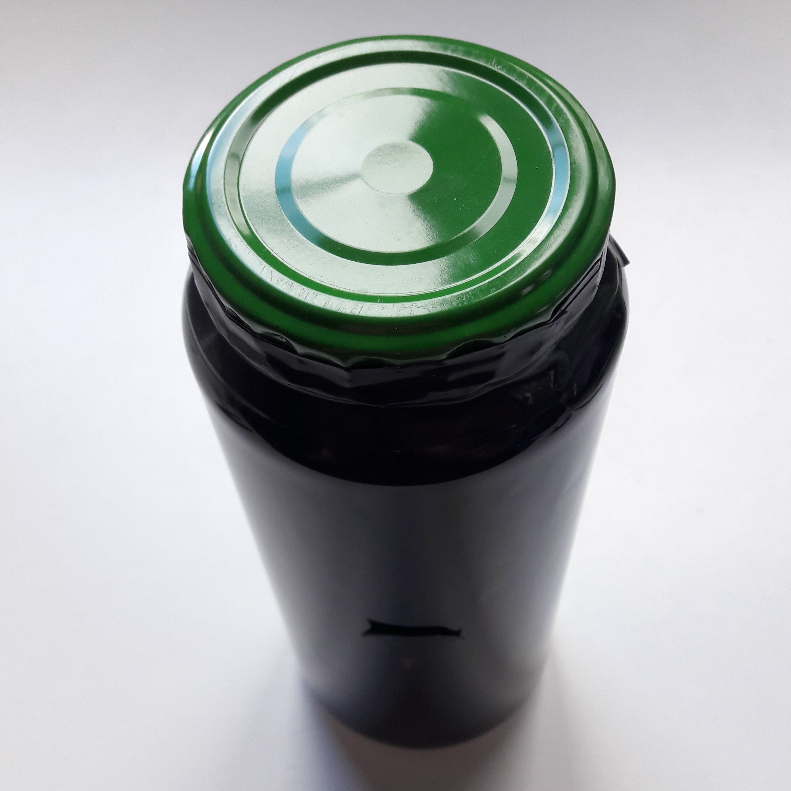

# **_(en travaux...)_**

Voici un petit tuto pour réaliser un sténopé et prendre une première photo📸 Il y a de nombreuses façons d'aborder cette activité, celle présentée ici nécessite peu de matériel.

## 1) Fabriquer son sténopé🏗️
### a) Matériel nécessaire🧰
- 2 canettes 33cL "Classic" en aluminium🥫 (si elle n'est pas aimantée c'est bon🧲)
- de la peinture noire🎨 (ex : acrylique)
- une aiguille 🪡
- du scotch noir🩹 (ex : chatterton)
- du papier photographique⬜

### b) Découpe✂️
Découper le bas d'une des deux canettes et le haut de l'autre. Vous avez maintenant un récipient et un capuchon. Il est aussi possible de fabriquer un capuchon avec un couvercle métallique de conserve. 

### c) Peinture🎨
Peindre en noir l’intérieur du récipient et du capuchon. Attendre que le tout sèche.

### d) Le trou🪡
A l'aide de l'aiguille, faire un petit trou (d'un diamètre d'environ 0.5mm) sur le flanc du récipient. C'est par ici que rentrera la lumière !

### e) Placer le papier⬜
⚠️⚠️ Cette opération doit être réalisée dans un environnement relativement obscure
🌜adaptez cette précaution en fonction de la sensibilité du papier🌛 ⚠️⚠️

A l'aide d'un bout de scotch placer le papier photographique dans le récipient en face du trou.

Refermer avec le capuchon et le scotch noir. Boucher aussi le trou avec un bout scotch noir🩹

La luminosité habituelle peut être restaurée🔆
## 2) Poser son appareil📸
Il y a de nombreux choix à faire concernant la prise de photo📸 En voici quelques uns :
- 📍lieu, la luminosité du lieu
- 🧭orientation vis à vis du soleil
- 🌄scène souhaitée
- ⌛le temps d'exposition
- 🔆la saison de l'année

Il faudra ensuite solidement fixer le sténopé (pour ne pas avoir une photo floue) puis enlever le scotch du trou. ⏳Attendre 1 à 2 semaines⌛ (en fonction de la sensibilité du papier, de l'ouverture et de la luminosité de la scène ce temps pourra varier énormément !!). Enfin revenir chercher le sténopé en fermant le trou avec le bout de scotch.

## 3) Développer la photo🎞️
Si vous n'avez pas de matériel pour fixer les photos, voici une technique vous permettant de vous en passer.

Faire les étapes suivantes rapidement et dans un environnement pas trop lumineux :
- ⬜sortir le papier photographique du sténopé
- 📱le scanner (ou le prendre en photo🙃)
- 🌃le remettre à l'abri de la lumière
Vous pouvez ensuite :
- 💻ouvrir le fichier ainsi créer avec Gimp (ou autre logiciel faisant du traitement d'image)
- 🔄faire une rotation de 180° de l'image
- ➖en prendre le négatif
- 🎛️adapter l'exposition, le contraste, etc...

Et voilà !! Votre photo est là 🥰

Elle n'est pas très belle ? Pas de panique, cela peut demander quelques essais avant de maitriser l'art du sténopé ! Vous pouvez lire les **compléments théoriques** pour mieux cerner d'où vient le problème ou simplement réessayer !

## 4) Des variantes😎

Je viens de présenter une façon de faire mais il y en a de nombreuses autres. De nombreux paramètres peuvent être changés, en voici quelque uns :
- 🥫le récipient, ici j'ai pris une cannette mais une boite de conserve ou de thé pourraient très bien faire l'affaire.
- 📏la distance entre le trou et le papier (parfois appelée focale)
- ⬛le papier, il est possible d'utiliser du film photographique qui a une bien plus grande sensibilité ou encore du papier positif.
- etc ... 